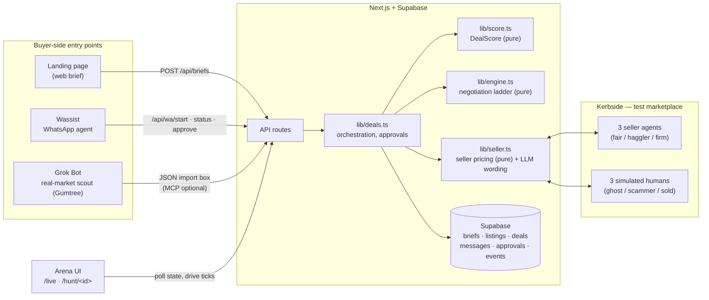

# DealDesk

**An AI agent for each side of a second-hand deal.**

🎥 Demo video: https://www.loom.com/share/c55d3231eb804755974286361ccd3f2e

---

## The problem

Buying something second-hand is a slog: scroll a dozen listings, message five sellers, get
ghosted by two, haggled badly by a third, and worry the whole time you're either overpaying or
about to get scammed by a deposit request. Selling is its own slog — answering "is this still
available?" for the tenth time, fielding lowballs, not knowing how low is too low.

DealDesk gives **each side its own AI agent**, and neither one can see the other's bottom line.

- **As a buyer**, you describe what you want, a target price and an absolute max. Your agent
  screens every listing (not just the first result), messages every seller, asks the questions a
  careful buyer asks, negotiates several deals in parallel, chases the slow ones, blocks scams
  outright, and brings you one recommended deal to approve with a single tap — on the dashboard
  or over WhatsApp.
- **As a seller**, you set a secret lowest price and disclose the item's known issues once. Your
  agent answers "is it available?" and condition questions instantly and honestly, negotiates
  down to your floor and no further, and arranges collection once the buyer approves. You never
  type a single message.

## What DealDesk does

1. You (or Wassist, on your behalf over WhatsApp) describe the item, a target price, and a max.
2. The buyer agent screens every listing against that brief and scores it with **DealScore**
   (below), skipping the ones that don't fit and flagging risky ones.
3. It messages every worthwhile seller at once, discloses that it's an AI up front, and
   negotiates a ladder of offers — deterministically, never above your secret max.
4. Seller agents (or simulated humans, on the test marketplace) reply in character: honestly
   disclosing any known issue, holding their floor, or in three cases, misbehaving on purpose
   (ghosting, running a payment scam, or turning out to have already sold) so the buyer agent has
   something real to defend you against.
5. When a deal lands inside the overlap of both sides' limits, you approve it — the other agent
   is told politely, the winning seller is asked for a postcode, and every other conversation
   closes itself out.

## DealScore — how it picks a good listing

Every listing gets scored out of 100 before it's ever contacted:

| Component | Out of | What it measures |
|---|---|---|
| **Fit** | 30 | Keyword/category match, size, condition floor, not wildly over budget — or the listing is skipped outright (`NO_MATCH`, `WRONG_SIZE`, `CONDITION_BELOW_MIN`, `FAR_ABOVE_BUDGET`) |
| **Seller trust** | 25 | Rating, review count, account age, minus a penalty for red-flag reviews ("never replied", "not as described", etc.) |
| **Condition** | 25 | Stated condition, minus points once an issue is actually disclosed in conversation |
| **Price** | 20 | Asking (or agreed) price against the market reference — median of real listings scouted, or the brief's target if there aren't at least three |

A listing is contacted if it isn't skipped and scores at least 50. Two or more risk flags
(`NEW_ACCOUNT`, `PRICE_TOO_GOOD`, `MAJOR_ISSUE`) earn a **HIGH RISK** badge — this is how the
one deliberately-scammy test listing gets flagged before the buyer agent ever messages it.
Among several agreed deals, the buyer is shown the one with the highest DealScore, then the
lowest price.

## The two secret limits

Every deal has exactly two numbers that never cross sides:

- **The buyer's max price** (and the current *ceiling* derived from it — it drops once a seller
  discloses a minor issue). Never appears in a seller-facing message, an LLM prompt, or an API
  response — except deliberately, in the buyer's own final "this is my best offer" line.
- **The seller's floor price**. Never leaves the seller's own pricing logic, never appears in any
  LLM prompt, never reaches the buyer side.

Both prices are decided by **pure, deterministic functions** — `lib/engine.ts` for the buyer's
ladder, `lib/seller.ts` for the seller's accept/counter math. LLMs only ever phrase the resulting
sentence; if a generated message ever drops the exact £ figure, the code falls back to a fixed
template rather than risk sending an ambiguous number. Deals land only inside the overlap of both
limits — or both agents walk away without either one learning where the other stood.

## How it fits together



Grok Bot's own job is read-only: it scouts real Gumtree listings for market prices and seller
feedback, and feeds them in — currently through the arena's JSON import box, with the MCP server
(5 tools: `get_brief`, `log_listing`, `next_move`, `request_approval`, `get_status`) specified but
optional per the amended plan, since the import box covers the same need. Wassist is the WhatsApp
front door: it starts hunts, reports status, and carries the buyer's approval back in, all
through plain REST endpoints — no LLM on our side for that reply text, so it can never leak a
secret limit even by accident.

## Tests

```
pnpm test
```

**33 tests, all green** (`vitest`), split across `test/score.test.ts` and `test/engine.test.ts`,
replaying the real `lib/engine.ts` and `lib/seller.ts` pricing code (via `test/simulate.ts`) so
they can't quietly drift from what's actually deployed:

- Every DealScore number from the demo hunt (Frank 86, Hana 72 → 73 final, Fiona 78, Gary 73,
  Sam 56 + HIGH RISK, Sally 83, Dave skipped WRONG_SIZE).
- Opening offer bounds (within 60% of asking and the target, never above asking).
- **A 10,000-run property test** over randomised briefs, listings, floors and personas: no offer
  ever exceeds the max, no agreement ever exceeds the ceiling. This is what caught a real rounding
  bug (`round5()` could push a ladder rung past a non-multiple-of-5 ceiling) before it shipped.
- A leak test (deliberately using max £261, chosen not to collide with any other number in the
  suite): that figure only ever appears in the one sanctioned "final offer" line.
- One case per scam-shield trigger (off-platform payment, upfront payment, courier-before-viewing,
  untraceable payment, move-off-platform) — the engine never replies to a scammer.
- Chase → chase → ghosted, and `wait` returning the correct remaining seconds.
- Sold → close, major issue disclosed → walk away.
- Statelessness: identical inputs produce identical decisions.
- The full demo hunt end-to-end, matching every outcome above from a cold start.

## What's simulated, and why

- **Kerbside** (`/market`) is a clearly-labelled test marketplace, not a real one — DealDesk never
  messages real marketplace users. It seeds ten listings: seven bikes (three run the real seller
  agent, three are simulated problem sellers — a ghost, a payment scammer, and one that's already
  sold — plus one wrong-size decoy), a console, a desk, and a jacket.
- The three **seller agents** (fair, haggler, firm) are the same deterministic pricing code a real
  seller would run — this is the actual seller-side product, demoed against itself.
- The three **simulated-human personas** exist specifically to prove the buyer agent's defensive
  behaviour: it has to actually detect a scam pitch, actually give up on a ghost after two
  chases, and actually notice "it's sold" rather than keep negotiating.
- Grok Bot's **real-market scan** is demonstrated via the JSON import box rather than a live MCP
  connection in this build — see Next steps.

## Tech stack

Next.js 15 (App Router) · TypeScript · Tailwind · pnpm · `@supabase/supabase-js` (server-only,
RLS on every table) · Vercel AI SDK via the Vercel AI Gateway (Grok models) · `mcp-handler` +
`@modelcontextprotocol/sdk` + `zod` for the optional MCP server · WhatsApp via Wassist's REST
integration · `vitest` · deployed on Vercel.

## How to run it

```bash
pnpm install
# supabase/schema.sql, then supabase/seed.sql, then supabase/migrations/001_v3.sql
# in the Supabase SQL editor
pnpm build
pnpm test
pnpm dev
```

Environment variables (`.env.local` locally, the same names in Vercel for production):

| Variable | Purpose |
|---|---|
| `NEXT_PUBLIC_APP_URL` | Public URL, used to build `/hunt/<id>` links |
| `SUPABASE_URL`, `SUPABASE_SECRET_KEY` | Server-only Supabase access |
| `AI_GATEWAY_API_KEY` | Vercel AI Gateway |
| `LLM_SMART_MODEL` | Brief parsing (`generateObject`) — pick a fast model; this doesn't need deep reasoning |
| `LLM_FAST_MODEL` | Seller message phrasing (`generateText`) |
| `MCP_API_KEY` | Auth for the MCP server and the `/api/wa/*` WhatsApp endpoints (`x-api-key` header or `?key=`) |
| `GHOST_TIMEOUT_SECONDS` | How long the buyer agent waits before chasing an unresponsive seller |

`TELEGRAM_*` variables are no longer used — approvals moved to WhatsApp (Wassist) and the arena's
own Approve/Decline buttons; §14 of `AGENTS.md` has the full amendment.

On the production URL: paste a brief into the landing page (or have Wassist call
`POST /api/wa/start`) and click **Run the hunt**, or open `/live` to follow whichever hunt is
newest. The arena drives the negotiation loop itself every 2.5 seconds until everything settles.

## Next steps

- Wire up the MCP server for real (all 5 tools are specified and the engine/DealScore functions
  they'd call are already built and tested) so Grok Bot can drive Kerbside chats itself and feed
  the real-market scan live, instead of through the JSON import fallback.
- A faster `LLM_SMART_MODEL` — the current one is a deep-reasoning model that measured ~65
  seconds for a single brief parse in testing; a lighter model would make brief parsing and the
  WhatsApp `/start` reply feel instant.
- The split chat view and the audience-view toggle were trimmed from this build's arena for time;
  both limits are shown unconditionally instead, which covers the demo but loses the "who can see
  what" toggle for a judge's Q&A.
- A real visual/interactive pass on the arena in an actual browser — everything here was verified
  through the API and local testing, not a live browser session.
